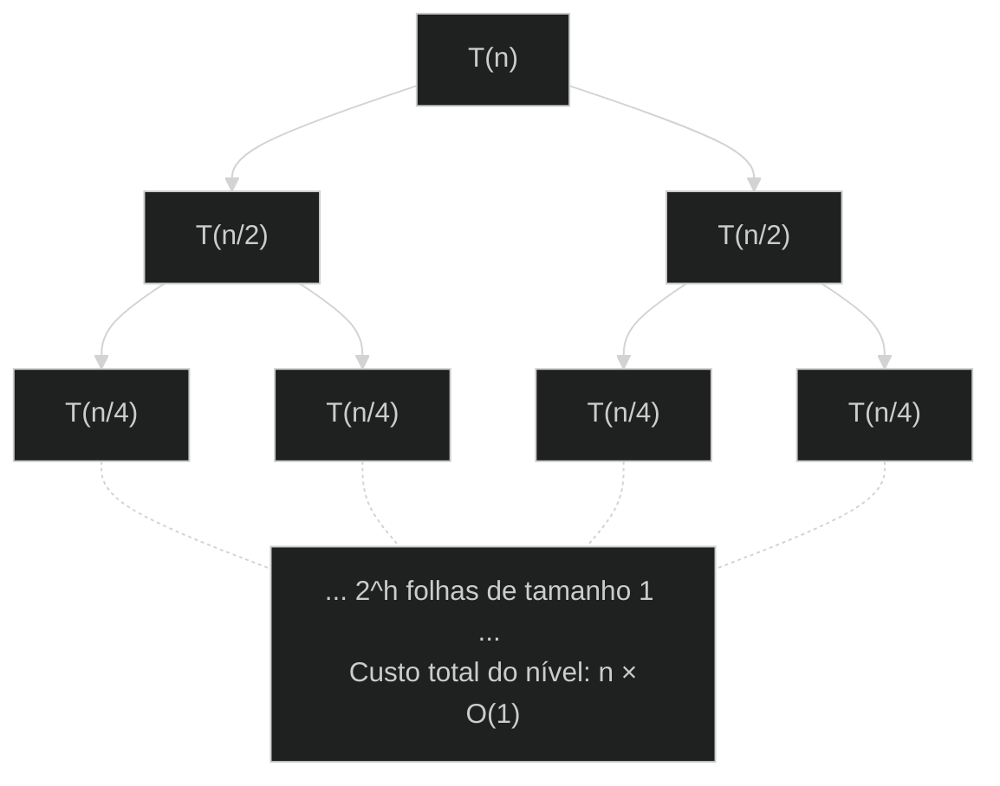

# divide-and-conquer


## Descrição do problema:

Assim como em algoritmos conhecidos, como o merge sort, a intenção é entender o algoritmo simple de divisão e conquista recursivo, a árvore de recursão e a análise assintótica do algoritmo. O objetivo será encontrar o maior e menor valores em um vetor qualquer. 

## Lógica:

Utilizando recursividade, o primeiro passo é ordenar o vetor de tamanho mais baixo possível, guardando os valores mínimo e máximo com uma comparação simples. Depois disso, a cada passo recursivo, os valores max e min são atualizados levando em consideração a "metade" esquerda e direita do vetor e fazendo a comparação entre elas.

## Pseudocódigo:

```text
a[1...n]

MAXMIN4(Linf, Lsup, max, min)
    if (Linf == Lsup)
        max = a[Linf]
        min = a[Linf]
    else if (Lsup - Linf == 1)
        if a[Linf] > a[Lsup]
            max = a[Linf]
            min = a[Lsup]
        else
            max = a[Linf]
            min = a[Lsup]
    else
        meio = (Linf + Lsup) / 2
        MAXMIN4(Linf, meio, max1, min1)
        MAXMIN4(meio + 1, Lsup, max2, min2)

        max = max(max1, max2)
        min = min(min1, min2)
```

## Análise recursiva:



### Rastreamento da Execução (Exemplo simples):

**Vetor:** `a = [7, 2, 9, 4]`

| Passo | Chamada | Subvetor | Operacao / Comparacao | Retorno | Estado da Pilha |
| --- | --- | --- | --- | --- | -- |
| **1** | `MAXMIN4(1, 4)` | `[7, 2, 9, 4]` | Divide no meio (indice 2) | — | `[ (1, 4) ]` |
| **2** | `MAXMIN4(1, 2)` | `[7, 2]` | Compara 7 e 2 | max1 = 7, min1 = 2 | `[ (1, 4), (1, 2) ]` |
| **3** | `MAXMIN4(3, 4)` | `[9, 4]` | Compara 9 e 4 | max2 = 9, min2 = 4 | `[ (1, 4), (3, 4) ]` |
| **4** | Combina | - | max(7, 9) e min(2, 4) | **max = 9, min = 2** | `[ ]` |

## Análise de recorrência e assintótica:

A função $T(n)$ representa a quantidade de operações executadas para um vetor de tamanho $n$:

$$ T(n) = \begin{cases} O(1) & \text{se } n \le 2 \\ 2T(n/2) + O(1) & \text{se } n > 2 \end{cases} $$

Analisando a árvore de recursão (onde a altura $h = \log_2 n$):

* **Nível 0:** $1$ nó de custo $c_1 \implies 1 \cdot O(1)$
* **Nível 1:** $2$ nós de custo $c_1 \implies 2 \cdot O(1)$
* **Nível 2:** $4$ nós de custo $c_1 \implies 4 \cdot O(1)$
* **Nível k:** $2^k$ nós de custo $c_1 \implies 2^k \cdot O(1)$
* **Nível folha ($h = \log_2 n$):** $2^h = n$ nós de custo base $O(1) \implies n \cdot O(1)$

Somando o trabalho de todos os níveis $k$ de $0$ a $\log_2 n$:

$$ T(n) = \sum_{k=0}^{\log_2 n} 2^k \cdot O(1) = O(1) \cdot \sum_{k=0}^{\log_2 n} 2^k $$

Pela soma da série geométrica:

$$ \sum_{k=0}^{h} 2^k = 2^{h+1} - 1 = 2 \cdot 2^{\log_2 n} - 1 = 2n - 1 $$

Portanto:

$$ T(n) = O(2n - 1) = O(n) $$

* **Complexidade de tempo:** $\Theta(n)$ — realiza exatas $\frac{3n}{2} - 2$ comparações no melhor e pior caso (para $n$ sendo potência de 2).
* **Complexidade de espaço:** $O(\log n)$ devido à profundidade máxima da pilha de chamada recursiva.

## Logs:

> Algoritmo implementado em [./src/main.rs](./src/main.rs)

```bash
[moises@archlinux divide-and-conquer]$ cargo run --release
    Finished `release` profile [optimized] target(s) in 0.01s
     Running `target/release/divide-and-conquer`
Vetor de 1000000 elementos gerado com sucesso!
O maior valor é: 2147472269
O menor valor é: -2147479181
Chamadas recursivas: 1048575
```