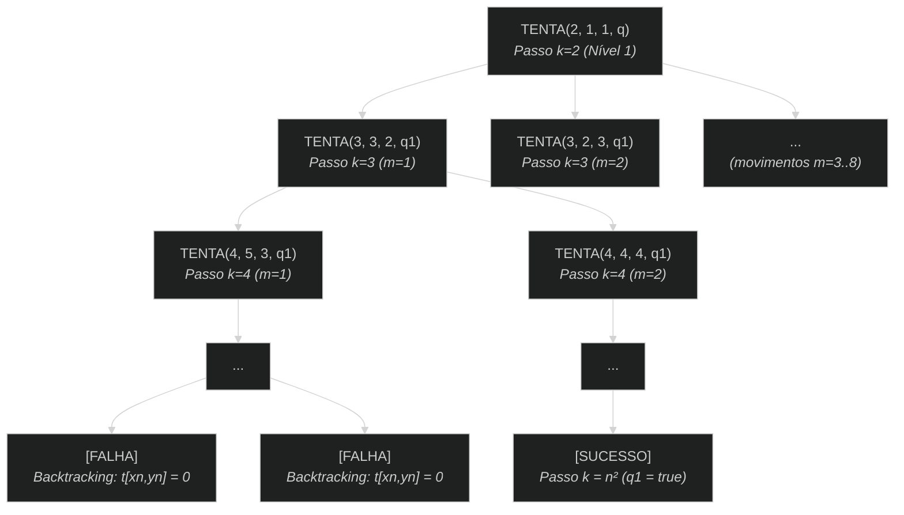

# knights-tour


## Descrição do problema:

O problema do passeio do cavalo propõe encontrar uma sequência de movimentos possíveis para que uma peça de cavalo (xadrez) possa percorrer todo o tabuleiro, sem repetir nenhuma casa.

## Lógica:

Para cada passo, o cavalo deve verificar as 8 posições possíveis de se movimentar. Para cada posição possível, deve-se verificar se aquela posição ainda não foi visitada. Se não foi visitada, visita-se e inicia-se um novo passo. Isso deve ocorrer enquanto não tiver realizado $n^2$ passos, onde $n$ é o tamanho do tabuleiro.

> **Nota sobre indexação:** O pseudocódigo e o modelo teórico utilizam indexação base 1 ($1 \dots n$) para facilitar a convenção matemática. A implementação prática em Rust e os logs de execução utilizam indexação base 0 ($0 \dots n-1$).

## Pseudocódigo:

```text
i, j --------------------------------- linhas e colunas do tabuleiro
t ------------------------------------ matriz t[1..n, 1..n] representando o tabuleiro
q ------------------------------------ booleano (solução encontrada?)
s ------------------------------------ intervalo de índices válidos: {1, ..., n}
h[] ---------------------------------- deslocamentos para i: [2, 1, -1, -2, -2, -1, 1, 2]
v[] ---------------------------------- deslocamentos para j: [1, 2, 2, 1, -1, -2, -2, -1]

// Inicialização da matriz
for i = 1 up to n
  for j = 1 up to n
    t[i, j] = 0
  endfor
endfor

t[1,1] = 1 --------------------------- casa inicial (passo 1)
TENTA(2, 1, 1, q) -------------------- tenta o passo 2 a partir de (1,1)

if (q) THEN
  print(t)
  print("Solução encontrada!")
else
  print("Solução não encontrada!")
endif

PROCEDURE TENTA(k, x, y, VAR q)
    m = 0
    q1 = false
    repeat
        m = m + 1
        xn = x + h[m]
        yn = y + v[m]
        if (xn ∈ s) AND (yn ∈ s) THEN
            if (t[xn,yn] == 0) THEN
                t[xn,yn] = k ------------------- registra o passo k
                if (k < n²) THEN
                    TENTA(k + 1, xn, yn, q1)
                    if (!q1) THEN
                        t[xn,yn] = 0 ----------- backtracking
                    endif
                else
                    q1 = true ------------------ tabuleiro completo
                endif
            endif
        endif
    until (q1) OR (m == 8)
    q = q1
END PROCEDURE
```

## Análise recursiva:



## Análise assintótica:

* **Complexidade de tempo:** $\mathcal{O}(8^{n^2})$ — Pior caso determinado pela exploração exaustiva de até 8 subproblemas por nível ao longo de $n^2$ níveis de profundidade da árvore de recursão.
* **Complexidade de espaço:** $\mathcal{O}(n^2)$ — Espaço dominado pela matriz do tabuleiro $n \times n$ e pela pilha de chamadas recursivas no caminho mais profundo da busca.

## Logs:

> Algoritmo implementado em [./src/main.rs](./src/main.rs)

* Iniciando na posição 0,0 (release):

```bash
[moises@archlinux knights-tour]$ cargo run --release
   Compiling knights-tour v0.1.0 (/home/moises/Documents/learn-rust/knights-tour)
    Finished `release` profile [optimized] target(s) in 0.10s
     Running `target/release/knights-tour`
Solução encontrada:
[1, 60, 39, 34, 31, 18, 9, 64]
[38, 35, 32, 61, 10, 63, 30, 17]
[59, 2, 37, 40, 33, 28, 19, 8]
[36, 49, 42, 27, 62, 11, 16, 29]
[43, 58, 3, 50, 41, 24, 7, 20]
[48, 51, 46, 55, 26, 21, 12, 15]
[57, 44, 53, 4, 23, 14, 25, 6]
[52, 47, 56, 45, 54, 5, 22, 13]
Tempo total: 78.394763ms
Chamadas recursivas: 8250732
Backtrackings (passos desfeitos): 8250669
```

* Iniciando na posição 3,3 (release):

```bash
[moises@archlinux knights-tour]$ cargo run --release
   Compiling knights-tour v0.1.0 (/home/moises/Documents/learn-rust/knights-tour)
    Finished `release` profile [optimized] target(s) in 0.08s
     Running `target/release/knights-tour`
Solução encontrada:
[33, 58, 39, 62, 31, 16, 7, 64]
[40, 61, 32, 27, 8, 63, 30, 15]
[57, 34, 59, 38, 43, 28, 17, 6]
[60, 41, 44, 1, 26, 9, 14, 29]
[45, 56, 35, 42, 37, 22, 5, 18]
[50, 53, 48, 25, 2, 19, 10, 13]
[55, 46, 51, 36, 21, 12, 23, 4]
[52, 49, 54, 47, 24, 3, 20, 11]
Tempo total: 53.047822768s
Chamadas recursivas: 5602853861
Backtrackings (passos desfeitos): 5602853798
```

Nos dois cenários tivemos sucesso em encontrar uma solução. No entanto, como podemos observar nos logs, o custo computacional foi muito maior no segundo cenário.

Essa diferença ocorre porque o algoritmo não utiliza uma heurística de ordenação (como a Heurística de Warnsdorff), dependendo exclusivamente da ordem fixa de movimentos definida pelos vetores h e v:

* **Partindo de (0,0):** A sequência fixa de movimentos guiou o algoritmo para cobrir os cantos e as bordas do tabuleiro logo nos primeiros passos. Isso evitou a criação de "casas isoladas" e reduziu o backtracking.
* **Partindo de (3,3):** A mesma sequência de movimentos fez o cavalo transitar primariamente pelo centro do tabuleiro nos passos iniciais. Com isso, os cantos e bordas ficaram isolados para o final do passeio, o que forçou a busca exaustiva em bilhões de caminhos sem saída até conseguir preencher todo o tabuleiro.